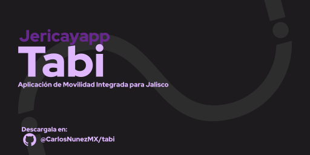

<p align="center"></p>
<h1 align="center">JericayApp/Tabi</h1>

Aplicación Integrada para la movilidad en el interior de la Zona Metropolitana de Guadalajara usando React Native.

## Building
> **Aplicación solo compatible con Android, soporte para iOS no planeado.**
Para hacer building de esta aplicación requieres:

- BunJS/NodeJS
- Un API Key de [Mapbox](mapbox.com/)

### Instrucciones
- Clone este repositorio:
```shell
git clone git@github.com:CarlosNunezMX/tabi.git
```
- Acceda a el y instale las dependecias.
```shell
cd tabi
bun/npm install # Instala las dependecias que se requieren de npm
bunx/npx jsr install # Instalan los paquetes `@carlosnunezmx/basutei` y `@carlosnunezmx/micard`
```

- Prepare el building
```shell
bunx/npx expo prebuild --clean
```

- Construya el aplicativo de pruebas.
```shell
bun/npm run android
```

